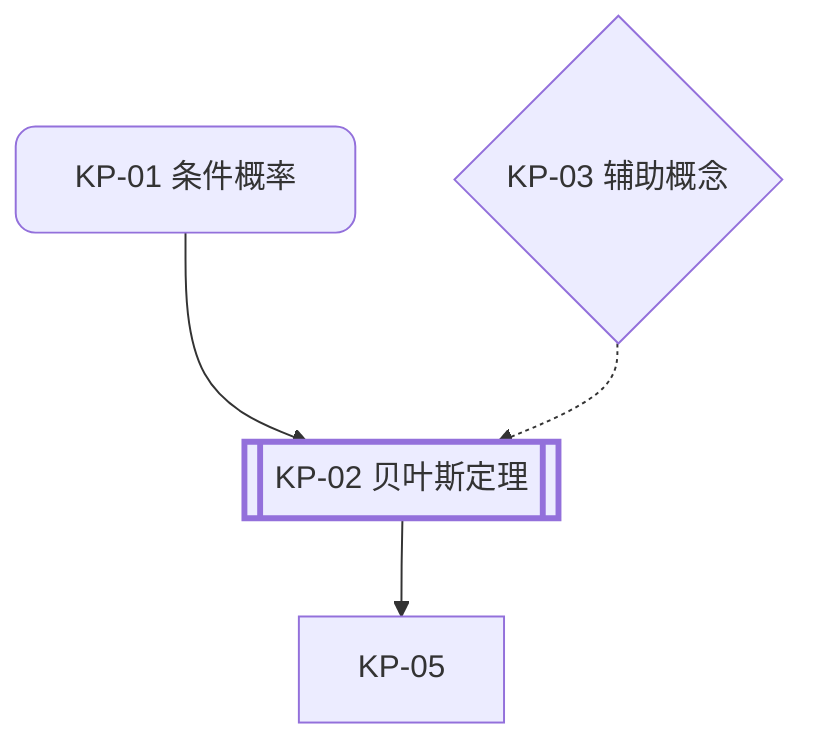

# 输出模板

使用这些模板创建此技能应维护的具体文件和关卡回复。

## 材料关卡

在任何规划或知识提取之前使用此清单：

```markdown
## 材料清单
- [ ] 教材或课程阅读材料
- [ ] PPT 幻灯片
- [ ] 老师划重点或复习范围
- [ ] 教学大纲或考试提纲
- [ ] 历年真题（如有）
- [ ] 课堂笔记（如有）
```

## 标准缺少材料回复

当学习者想要考试备考帮助但尚未上传真实课程材料时使用此回复：

```markdown
我理解你想要准备考试，但首先有一个关键问题：我需要你的教材、PPT 幻灯片或教学大纲才能有效地帮助你。

大学考试通常基于老师课堂上教的内容和教材或幻灯片中展示的特定知识点。如果我仅凭通用知识帮助你，会立即出现三个问题：

- 我的措辞可能与老师的措辞不匹配。
- 我强调的主题可能不是你的老师要考的主题。
- 我选择的例子可能与教材和考试风格不同。

请先上传你的课程材料。即使是 PPT 幻灯片、复习范围的照片或教学大纲截图也足以开始。
```

## 预期输入结构

在工作流开始时，如果工作目录中尚无材料文件夹，主动创建以下目录结构：

```text
materials/
  lectures/      ← 教材、讲义、课件 PDF
  notes/         ← 课堂笔记、个人笔记
  recordings/    ← 课堂录音摘要
  past-papers/   ← 历年真题
  supplements/   ← 补充材料、参考书、习题集
```

创建后向用户说明每个文件夹的用途，请用户将材料放入对应文件夹。如果用户已上传材料但未分类，帮助将文件移动到对应的子文件夹中。实际文件夹名称可以不同，将它们映射到最接近的类别并继续。

## 预期输出结构

```text
_analysis/                ← Agent 团队分析产出（中间结果）
  past-paper-analysis-1.md      ← 第一波：真题深度分析（每份试卷一个 Agent）
  past-paper-analysis-2.md      ← 第一波：真题深度分析（每份试卷一个 Agent）
  ...
  slides-notes-analysis.md      ← 第一波：课件与笔记分析
  supplement-analysis.md        ← 第一波：补充材料分析
  lecture-analysis-1.md          ← 第二波：讲义分析（每个文件一个 Agent，真题引导）
  lecture-analysis-2.md          ← 第二波：讲义分析（每个文件一个 Agent，真题引导）
  ...
  quality-review.md
knowledgepointslist.md           ← 含 Mermaid 知识点关系图
study-plan.md
knowledge-points/
  KP-01-topic-one.md             ← 文件名以序号开头，含该知识点的真题完整解析和题型解题流程
  KP-02-topic-two.md
  ...
```

## 1. `knowledgepointslist.md`

```markdown
# 知识点列表

## 课程
- 名称：
- 已扫描材料：
- 当前规划模式：紧急突击 / 短期冲刺 / 标准倒计时

## 真题覆盖摘要
- 发现的真题总数：
- 已被知识点覆盖：
- 未覆盖的题目：
- 覆盖状态：通过 / 未完成

## 知识点关系图



> 图例：双框 = 考试关键，圆角 = 前置知识，菱形 = 辅助主题。实线箭头 = 必须先学，虚线 = 相关联。

## 有序知识点
| 阅读顺序 | 主题 | 类型 | 前置知识 | 为何现在学 | 考试相关性 | 关联真题 | 关联材料证据 | 主要来源 | 状态 |
| --- | --- | --- | --- | --- | --- | --- | --- | --- | --- |
| KP-01 | 条件概率 | 前置 | 基础概率、事件表示法 | 解锁贝叶斯定理和应用题 | 高 | 2024 期中 Q2；2023 期末 Q1(b) | lecture-03.pdf p.12；week-3-slides.pdf 第8张；notes/probability.md | lectures/week-3.pdf；past-papers/2024-midterm.pdf | 未开始 |
| KP-02 | 贝叶斯定理 | 考试关键 | 条件概率 | 频繁考试目标 | 高 | 2023 期末 Q4；2022 补考 Q3 | slides/bayes.pdf 第14张；notes/bayes.md；recordings/week-5-summary.md | notes/bayes.md；past-papers/finals-2023.pdf | 未开始 |

## 未覆盖的真题
- 无
- 如果不为空，明确列出每道未覆盖的题目，不要声称知识图谱已完整。

## 备注
- 主要按教学顺序排列，在此基础上按前置依赖微调。
- 将新发现的前置主题插入正确位置，而非追加到末尾。
```

## 2. `study-plan.md`

```markdown
# 学习计划

## 时间线
- 可用天数：
- 规划模式：
- 主要风险：
- 通过策略：

## 阶段计划
### 第一阶段：基础修补
- 天数：
- 主题：
- 退出标准：

### 第二阶段：高收益核心主题
- 天数：
- 主题：
- 退出标准：

### 第三阶段：真题题型训练
- 天数：
- 主题：
- 退出标准：

### 第四阶段：最终复习
- 天数：
- 主题：
- 退出标准：

## 每日安排
| 天 | 主题 | 任务 | 要求产出 | 完成检查 |
| --- | --- | --- | --- | --- |
| 第1天 | KP-01 条件概率 | 阅读主题文件，解8道基础题，口述定义 | 更新笔记 + 已解题集 | 能不看笔记做对6/8 |

## 不可妥协项
- 复习时段：
- 练习时段：
- 缓冲时间：
- 最终模考：
```

## 3. `knowledge-points/KP-<序号>-<slug>.md`

文件名必须以序号开头，如 `KP-01-conditional-probability.md`，让用户在文件列表中一目了然地看出学习顺序。

```markdown
# KP-01 条件概率

## 课程定位
- 类型：前置 / 辅助 / 考试关键
- 阅读顺序：
- 为什么重要：
- 在材料中出现的位置：
- 关联真题：

## 材料证据
- 讲义或教材来源：
- PPT 或幻灯片来源：
- 笔记来源：
- 录音或口头来源：
- 补充材料来源：
- 值得保留的老师用语：

## 学习目标
- 读完此文件后，学习者应能：
- 为什么这个主题对初学者来说很难：

## 通过考试必须理解的内容
- 最低通过水平的理解：
- 目前可以忽略的内容：

## 前置知识
- 必须先学：
- 可选的辅助概念：

## 核心教学部分（最重要、最长的部分，投入最多篇幅）

## 1. 问题
- 从工程困境、物理悖论或实际失败案例开始（不要以定义开始）：

## 2. 直觉
- 用大白话解释，给出至少一个生活化例子：

## 3. 具体案例
- 几个比较基础和简单的案例实践

## 4. 严格推导
- 公式、每个符号含义、何时有效/无效：

## 5. 完整例题
- 题目 + 完整逐步解答：

## 题型通用解题流程
对该知识点下的真题进行归类，提炼每种题型的通用解题模板：

### 题型一：[题型名称]
- 识别特征：什么时候用这个流程
- 解题步骤：
  1. ...
  2. ...
- 常见变体：
- 易错点：

### 题型二：[题型名称]
...

## 真题完整解析

### [年份] [考试名称] 题 [编号]

**原题**：
> [完整题目文本，逐字复现]

**分值**：

**整体解题思路**：
- 这道题考什么：
- 该用什么方法/为什么：
- 对应上方哪个题型流程：

**逐步解题**：
1. [第一步] — 依据：
2. [第二步] — 依据：
> 繁重计算使用代码工具完成，直接给出结果。

**得分关键步骤**：

**常见错误**：

---

### [下一道题]
...

## 材料到考试的桥梁
- 哪份材料最直接地准备这道真题：

## 常见错误
- 错误 1：
- 错误 2：
- 如何避免这些错误：

## 快速自检
- 问题 1：
- 问题 2：
- 问题 3：

## 掌握检查表
- [ ] 我能用通俗语言解释这个主题。
- [ ] 我知道什么时候使用它。
- [ ] 我知道什么时候不该使用它。
- [ ] 我能做一道关于它的标准考试题。
- [ ] 我能识别常见陷阱。

## 链接
- 此主题解锁的父主题：
- 下一步要学的主题：
```

## 4. 深入拆解更新模式

当学习者表示某个主题依赖于未知前置知识时：创建新知识点文件，更新 `knowledgepointslist.md`、`study-plan.md` 和父主题文件，重新检查真题覆盖。

## 时间线规则

- 学习者剩余 7 天或更少时使用"紧急突击"。
- 学习者剩余 8 到 21 天时使用"短期冲刺"。
- 学习者剩余超过 21 天时使用"标准倒计时"。
