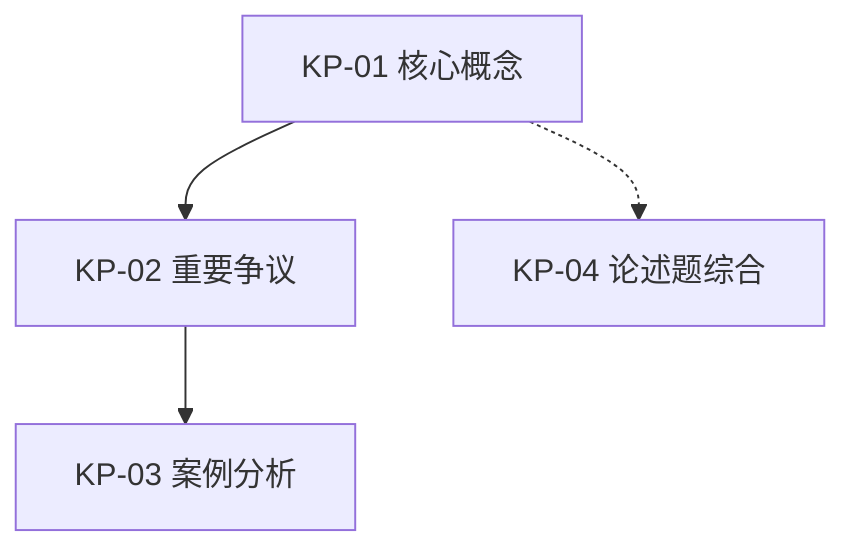
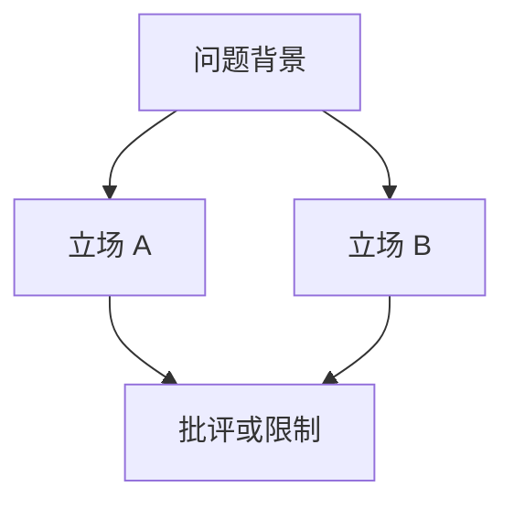

# 人文社科路径输出模板

本文件只用于 `discipline_track=humanities-social-sciences` 的项目。人文社科输出不追求理工科式的严格推导、公式表或固定解题流程；重点是把课程材料和各 subagent 的分析提炼成可背、可复述、可举例、可比较的考试内容。

## 目录

- 材料关卡与缺少材料回复
- 项目工作区、输入与输出目录结构
- `knowledgepointslist.md`
- `_analysis/questions/<source-slug>.json`
- `_analysis/question-index.json`
- `_analysis/question-index.md`
- `_analysis/coverage-audit.md`
- `_analysis/exam-tutor-state.json`
- `study-plan.md`
- `knowledge-points/KP-<序号>-<slug>.md`
- 时间线规则

## 总原则

- 模板是写作支架，不是逐项打勾的硬性表格。材料不足或课程不适用的小节可以合并、压缩或省略。
- 每个最终文件要优先回答三个问题：这门课怎么看这个问题、能举什么例子、如何围绕一个问题展开分析。
- subagent 的材料分析不需要原样搬运到最终文件；父流程和 Writer Agent 应提炼、归纳、合并重复内容，留下观点、事例、比较维度和可复述的分析结论。
- 课程材料、老师措辞、考试说明和真实题目优先于通用百科知识。
- 不生成泛化议论文素材；没有材料证据时，明确标注低置信度或需要补充材料。

## 材料关卡

在任何规划或知识提取之前使用此清单：

```markdown
## 材料清单
- [ ] 考试说明、复习范围或老师划重点
- [ ] 历年真题、样题或复习题（如有）
- [ ] PPT、讲义或课程阅读材料
- [ ] 课堂笔记、录音摘要或课程总结
- [ ] 案例、政策、文本、新闻事件或补充材料
```

## 项目工作区结构

首次启动新备考项目时，必须先同时询问项目名和学科路径。选择人文社科后，用项目名创建独立工作区。初始化只创建结构和状态，不分析材料。

```text
<project-name>/
  PROJECT.md
  materials/
    lectures/                   ← PPT、讲义、教材节选、指定阅读
    notes/                      ← 课堂笔记、个人笔记、老师口头提示
    recordings/                 ← 课堂录音摘要
    past-papers/                ← 历年真题、样题、复习题
    supplements/                ← 案例、政策、事件、文本、补充材料
  _analysis/
    questions/
    exam-tutor-state.json       ← mode=waiting-for-materials
  knowledge-points/
```

初始化完成后回复：

```markdown
已创建备考项目工作区：`<workspace-dir>`

学科路径：人文社科

请把资料放入：
- `materials/past-papers/`：历年真题、样题、复习题
- `materials/lectures/`：PPT、讲义、教材节选、指定阅读
- `materials/notes/`：课堂笔记、老师口头提示、个人笔记
- `materials/recordings/`：课堂录音摘要
- `materials/supplements/`：案例、政策、事件、文本、补充材料

放好后告诉我“开始工作”，我会先检查材料，再按人文社科路径提炼观点、事例、分析框架和可用于问题分析的材料。
```

## `PROJECT.md`

```markdown
# <project-name>

这是一个 exam-tutor 备考项目工作区。

## 当前状态
- 状态：等待资料
- 学科路径：人文社科
- 路由文件：references/tracks/humanities-social-sciences/workflow.md
- 下一步：把课程资料放入 `materials/` 下对应目录，然后告诉 agent “开始工作”。

## 材料目录
- `materials/past-papers/`：历年真题、样题、复习题
- `materials/lectures/`：PPT、讲义、教材节选、指定阅读
- `materials/notes/`：课堂笔记、老师口头提示、个人笔记
- `materials/recordings/`：课堂录音摘要
- `materials/supplements/`：案例、政策、事件、文本、补充材料

## 后续产物
- `knowledgepointslist.md`
- `knowledge-points/`
- `study-plan.md`
- `_analysis/`
```

## 标准缺少材料回复

当学习者想要考试备考帮助但尚未上传真实课程材料时使用此回复：

```markdown
我需要先看到这门课的真实材料，才能帮你整理有用的文科考试内容。

人文社科考试通常看重老师如何定义概念、如何组织观点、用了哪些案例和文本、希望你用什么语言作答。如果只凭通用知识整理，容易出现三个问题：

- 观点和老师讲法不一致。
- 案例不贴合课程。
- 答案框架看起来完整，但写不到老师想看的点上。

请先放入 PPT、讲义、阅读材料、课程总结、复习范围或真题。即使只有几份课件或一张复习范围截图，也可以开始提炼。
```

## 预期输入结构

在项目工作区内，如果尚无材料文件夹，主动创建以下目录结构：

```text
materials/
  lectures/      ← PPT、讲义、教材节选、指定阅读
  notes/         ← 课堂笔记、老师口头提示、个人笔记
  recordings/    ← 课堂录音摘要
  past-papers/   ← 历年真题、样题、复习题
  supplements/   ← 案例、政策、事件、文本、补充材料
```

如果用户已上传材料但未分类，帮助将文件移动到最接近的子文件夹。实际文件夹名称可以不同，只要在状态文件和材料清单中记录映射即可。

## 预期输出结构

```text
_analysis/
  exam-tutor-state.json
  question-index.json
  question-index.md
  coverage-audit.md
  quality-review.md
  questions/
    2025-final.json
    sample-questions.json
  past-paper-analysis-2025-final.md
  lecture-analysis-week-01.md
  lecture-analysis-week-02.md
  slides-notes-analysis.md
  supplement-analysis.md
knowledgepointslist.md
study-plan.md
knowledge-points/
  KP-01-topic-one.md
  KP-02-topic-two.md
```

`_analysis/*-analysis*.md` 是 subagent 的中间材料，不强制使用本文件的最终产物模板。中间分析可以自由组织，只要信息充分、出处清楚、关系讲明白。最终 `knowledgepointslist.md` 和 `knowledge-points/` 应对这些内容做综合提炼，不需要完整复制每个 subagent 的小标题。

## 1. `knowledgepointslist.md`

````markdown
# 知识点列表

## 课程
- 名称：
- 已扫描材料：
- 当前规划模式：紧急突击 / 短期冲刺 / 标准倒计时
- 整理依据：真题优先 / lecture-first / 复习范围优先 / 混合

## 考试重点摘要
- 已发现题目数：
- 主要题型：
- 高频主题：
- 课程重点来源：
- 低置信度风险：

## 课程议题图



> 图例可按课程需要调整。重点展示概念关系、理论谱系、争议结构、案例归属或答题路径。

## 有序专题
| 阅读顺序 | 专题 | 类型 | 核心问题 | 关键观点 | 代表事例 | 关联题目 | 主要材料 | 状态 |
| --- | --- | --- | --- | --- | --- | --- | --- | --- |
| KP-01 | 现代性与社会变迁 | 概念/理论 | 课程如何理解现代性 | 现代性既是制度变迁，也是生活经验变化 | 城市化、劳动分工 | Q-2025-final-01 | week-01 slides | 未开始 |

## 未覆盖或低置信度内容
- 未覆盖题目：
- 材料证据不足的专题：
- 需要用户补充的材料：

## 备注
- 默认按课程讲授顺序排列；若真题或复习范围更明确，可按考试收益微调。
- 合并重复主题时保留原始 lecture 或材料来源，方便回溯。
````

## 1.4. `_analysis/questions/<source-slug>.json`

这是单份真题、样题或复习题分析 Agent 输出的结构化题目片段。主流程会合并这些片段生成 `_analysis/question-index.json`。

```json
{
  "source_file": "materials/past-papers/2025-final.pdf",
  "questions": [
    {
      "id": "Q-2025-final-01",
      "exam": "2025 final",
      "number": "1",
      "points": "",
      "text_verbatim": "完整题目文本，逐字复现。",
      "question_type": "名词解释 | 简答 | 比较题 | 材料分析 | 案例分析 | 论述题 | 评论题",
      "initial_topics": [],
      "related_concepts": [],
      "related_authors_or_texts": [],
      "related_cases": [],
      "answer_shape": "定义型 | 比较型 | 材料分析型 | 综合论述型",
      "difficulty": "low | medium | high",
      "extraction_confidence": "high | medium | low",
      "evidence_anchor": "p.1",
      "notes": ""
    }
  ]
}
```

## 1.5. `_analysis/question-index.json`

这是所有题目的结构化总表。知识图谱、知识点文件、学习计划和质量审查都应引用这里的题目 ID。

```json
{
  "questions": [
    {
      "id": "Q-2025-final-01",
      "source_file": "materials/past-papers/2025-final.pdf",
      "exam": "2025 final",
      "number": "1",
      "points": "10",
      "text_verbatim": "完整题目文本，逐字复现。",
      "question_type": "论述题",
      "initial_topics": ["现代性", "社会变迁"],
      "related_concepts": ["现代性", "理性化"],
      "related_authors_or_texts": ["韦伯"],
      "related_cases": ["城市化"],
      "answer_shape": "综合论述型",
      "difficulty": "medium",
      "extraction_confidence": "high",
      "evidence_anchor": "p.1",
      "notes": ""
    }
  ],
  "no_question_sources_note": ""
}
```

没有真题或样题时：

```json
{
  "questions": [],
  "no_question_sources_note": "未发现真题或样题；后续依据考试说明、课程总结、老师强调和材料结构整理重点。"
}
```

## 1.6. `_analysis/question-index.md`

```markdown
# 题目索引

## 概览
- 来源文件数：
- 题目总数：
- 主要题型：
- 低置信度题目：
- 如果没有真题，替代依据：

## 按来源列出的题目

### materials/past-papers/2025-final.pdf

#### Q-2025-final-01
- 题号：
- 分值：
- 题型：
- 初步主题：
- 可能用到的概念/作者/案例：
- 提取置信度：
- 证据位置：

**原题**：
> [逐字题目文本]
```

## 1.7. `_analysis/coverage-audit.md`

人文社科审计不只检查真题覆盖，还检查课程重点、观点、事例和分析是否被提炼进最终文件。

```markdown
# 覆盖审计

## 总览
- question-index 总题数：
- 已映射到 KP：
- 未覆盖题目：
- 已扫描材料数：
- 已纳入 KP 的核心 lecture / 阅读 / 案例：
- 低置信度风险：
- 审计状态：通过 / 需补充

## 题目覆盖表
| 题目 ID | 来源 | 映射 KP | 解析文件 | 状态 | 风险 |
| --- | --- | --- | --- | --- | --- |
| Q-2025-final-01 | 2025-final.pdf p.1 | KP-02 现代性争议 | knowledge-points/KP-02-modernity.md | 已覆盖 | 无 |

## 材料重点覆盖表
| 材料 | 提炼出的核心观点 | 代表事例 | 对应 KP | 风险 |
| --- | --- | --- | --- | --- |
| week-01 slides | 现代性包含制度与经验两层 | 城市化 | KP-01 | 无 |

## 需要修正的问题
1. ...
```

## 1.8. `_analysis/exam-tutor-state.json`

下面是项目初始化后的状态示例。正式分析、增量更新、审查或修复后，保留同一字段结构并更新 `mode`、`runtime.completed_phases`、材料列表和覆盖统计。

```json
{
  "project_name": "",
  "workspace_dir": "",
  "course_name": "",
  "discipline_track": "humanities-social-sciences",
  "route": {
    "locked": true,
    "workflow": "references/tracks/humanities-social-sciences/workflow.md",
    "selected_label": "人文社科"
  },
  "last_updated": "YYYY-MM-DD HH:MM",
  "mode": "project-bootstrap | waiting-for-materials | full-build | incremental-update | audit | topic-repair",
  "runtime": {
    "host": "claude | codex | kimi | fallback",
    "mode": "setup-only | full-build | resume | audit-only | topic-repair",
    "execution_strategy": "team | serial",
    "agent_team_capable": false,
    "fallback_reason": "",
    "completed_phases": [
      "project_workspace_init"
    ],
    "last_phase": "project_workspace_init",
    "reused_outputs": [],
    "pending_outputs": []
  },
  "materials": [],
  "question_count": 0,
  "knowledge_point_count": 0,
  "coverage": {
    "covered": 0,
    "uncovered": 0,
    "low_confidence_questions": 0,
    "low_confidence_topics": 0
  },
  "outputs": {
    "knowledgepointslist": "knowledgepointslist.md",
    "study_plan": "study-plan.md",
    "knowledge_points_dir": "knowledge-points/"
  },
  "next_actions": []
}
```

## 2. `study-plan.md`

```markdown
# 学习计划

## 时间线
- 可用天数：
- 规划模式：
- 主要风险：
- 通过策略：

## 阶段计划
### 第一阶段：课程主线和概念
- 天数：
- 主题：
- 退出标准：

### 第二阶段：观点、事例和比较
- 天数：
- 主题：
- 退出标准：

### 第三阶段：问题分析训练
- 天数：
- 主题：
- 退出标准：

### 第四阶段：考前压缩和限时输出
- 天数：
- 主题：
- 退出标准：

## 每日安排
| 天 | 主题 | 任务 | 要求产出 | 完成检查 |
| --- | --- | --- | --- | --- |
| 第1天 | KP-01 现代性 | 阅读专题，背核心概念，整理2个案例 | 200字概念解释 + 1个案例分析 | 能不看材料讲清观点和例子 |

## 不可妥协项
- 每天至少复述若干核心概念。
- 每天积累或复习若干可直接写入答案的案例句。
- 考前必须做限时综合问题分析。
```

## 3. `knowledge-points/KP-<序号>-<slug>.md`

文件名必须以序号开头，如 `KP-01-modernity.md`，让用户在文件列表中一目了然地看出学习顺序。

### 专题文件写作契约

人文社科 KP 是一份考试专题讲义。它不需要把所有小节机械填满，但至少应让学生得到：

- 一个清楚的问题意识。
- 一组课程中的核心观点。
- 若干能支撑观点的事例、文本或材料证据。
- 对这些观点和事例的分析，而不只是罗列名称。
- 一个能串联本专题核心观点和案例的自拟问题；如果材料不适合出题，可以省略并说明原因。

#### 内容取舍

优先保留：

- 老师讲法、课程定义、关键词和评价语。
- 重要观点的主张、理由、证据、批评或限制。
- 代表案例、政策事件、文本细节、课堂材料。
- 概念之间的比较维度、理论谱系和争议结构。
- 清晰的概念界定、比较维度、观点判断和案例分析角度。

可以压缩或删除：

- 与考试无关的背景故事。
- 重复材料和重复例子。
- 不能支撑观点的泛泛介绍。
- 课程材料没有出现、也无法服务答题的百科扩展。

#### Callout 使用规范

| Callout 类型 | 用途 |
| --- | --- |
| `> [!tip] 学习指南` | 文件开头，说明本专题要解决的问题、考试用途和优先级 |
| `> [!note] 观点提炼` | 提炼课程中的关键观点，写成可复述的话 |
| `> [!example] 事例` | 展示能支撑观点的案例、文本或材料细节 |
| `> [!warning] 易混点` | 概念混淆、立场误读、案例误用、答题跑题 |
| `> [!tip] 考前速记` | 文件末尾，压缩为最值得背住的观点和例子 |

#### 薄文档判定

出现以下任一情况，视为深度不足，需要扩展：

- 只有关键词和标题，没有观点解释。
- 只有案例名，没有说明案例如何支撑观点。
- 只有立场，没有理由、证据、批评或限制。
- 只有模板化分析框架，没有课程材料内容。
- 没有把 subagent 的材料分析提炼成自己的综合判断。

````markdown
# KP-01 专题名

> [!tip] 学习指南
> 本专题要解决的问题：
> 考试用途：
> 最重要的观点：
> 最值得背的事例：

## 课程定位
- 类型：概念 / 作者文本 / 理论争议 / 案例群 / 历史脉络 / 综合论述
- 阅读顺序：
- 为什么重要：
- 关联题目：

## 材料来源
- 主要 lecture / PPT：
- 阅读文本：
- 笔记或老师强调：
- 补充案例：
- subagent 提炼依据：

## 一句话主线

用 1-3 句话概括这个专题在课程中的位置和核心结论。

## 核心问题

- 这个专题回应什么问题：
- 为什么课程要讨论它：
- 它容易和哪些问题混在一起：

## 观点提炼

> [!note] 观点提炼
> 把课程中的重要观点写成“主张 - 理由/证据 - 限制/批评 - 分析结论”。

### 观点一：[观点名]
- 主张：
- 理由或机制：
- 材料证据：
- 可能的批评或限制：
- 分析结论：

### 观点二：[观点名]
- 主张：
- 理由或机制：
- 材料证据：
- 可能的批评或限制：
- 分析结论：

## 概念和比较

| 概念 | 课程中的含义 | 易混概念 | 区分方式 | 可用于什么题 |
| --- | --- | --- | --- | --- |
| 概念 A | ... | 概念 B | ... | 可用于分析的问题 |

## 理论谱系或争议结构



- 争议问题：
- 立场 A：
- 立场 B：
- 比较维度：
- 可以如何评价：

## 事例与材料分析

> [!example] 事例
> 不只写案例名，还要写清楚它说明了什么、能支撑哪一个观点、可用于分析什么问题。

### 事例一：[案例/文本/事件]
- 基本内容：
- 支撑的观点：
- 分析角度：
- 分析结论：

### 事例二：[案例/文本/事件]
- 基本内容：
- 支撑的观点：
- 分析角度：
- 分析结论：

## 自拟题目分析

### Q-2025-final-01

**原题**：
> [完整题目文本，逐字复现]

**这道题考什么**：

**可用观点**：

**可用事例**：

**分析路径**：

**容易失分的地方**：

---

没有真题时，如材料足够，设计一道问题；如果材料不适合出题，可以写“暂无合适自拟题目”：

- 自拟题目：
- 为什么值得分析：
- 可用观点：
- 可用事例：
- 分析路径：
- 需要避开的误区：

## 常见误区

> [!warning] 易混点
> 写出本专题最容易混淆、误读或答偏的地方。

- 误区 1：
- 误区 2：
- 如何避免：

## 快速自检

- 我能不能用自己的话说明核心问题？
- 我能不能说出至少两个课程观点？
- 我能不能用一个具体事例支撑观点？
- 我能不能围绕一个问题写出一段分析？

> [!tip] 考前速记
> 1. 核心观点：
> 2. 必背事例：
> 3. 最清楚的分析结论：

## 链接
- 前一专题：
- 相关专题：
- 后续专题：
````

## 4. 时间线规则

- 学习者剩余 7 天或更少时使用“紧急突击”：优先背核心观点、代表事例和高频题型表达。
- 学习者剩余 8 到 21 天时使用“短期冲刺”：按专题整理观点和事例，并安排简答/论述训练。
- 学习者剩余超过 21 天时使用“标准倒计时”：按课程顺序建立概念、理论谱系、案例库和题型输出能力。
