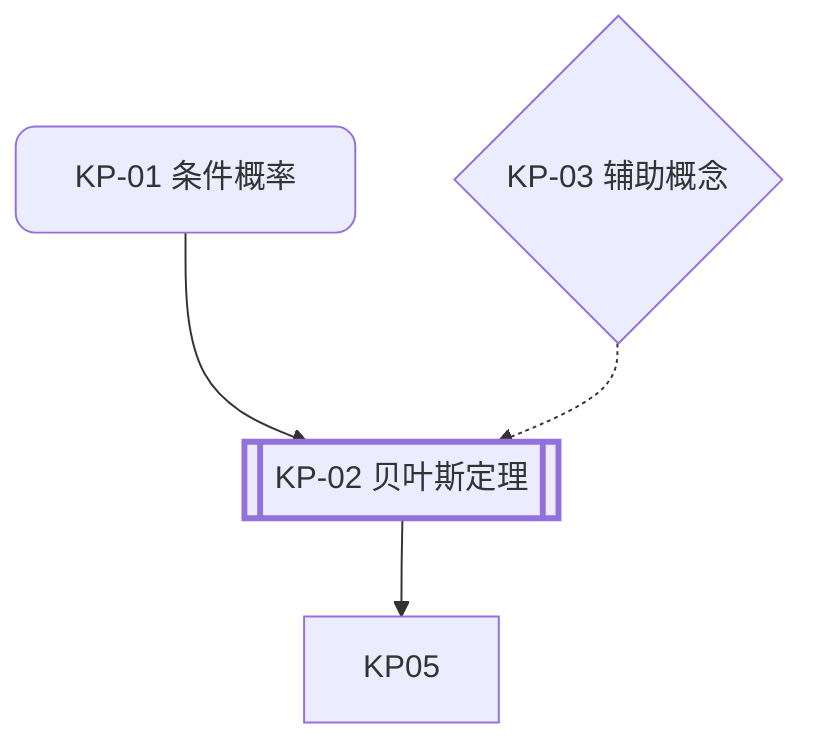
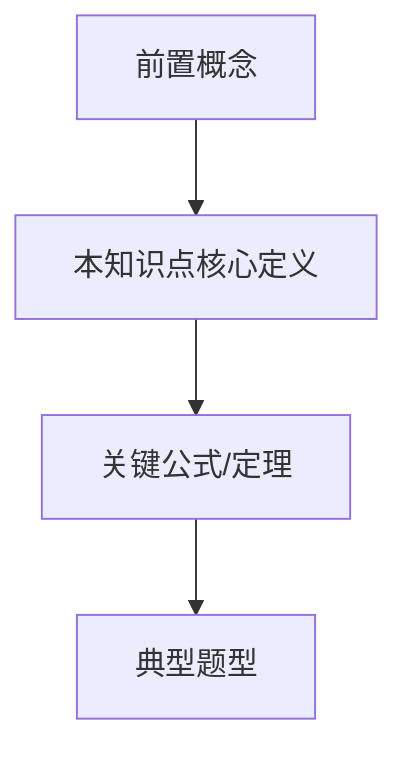
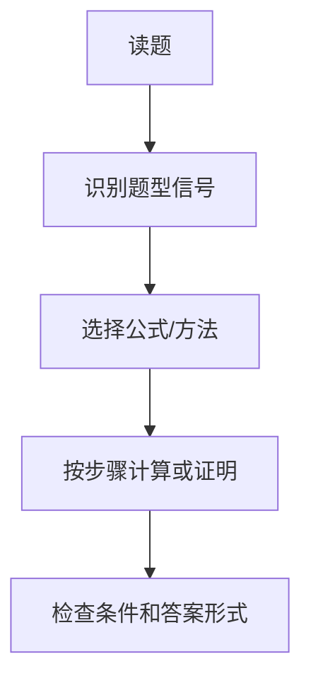

# 理工科路径输出模板

本文件只用于 `discipline_track=stem` 的项目。使用这些模板创建理工科路径应维护的具体文件和关卡回复。本文件是理工科路径产物结构、Markdown 模板和 JSON schema 的唯一事实源；其他参考文件只描述何时生成或如何使用这些产物。

## 目录

- 材料关卡与缺少材料回复
- 项目工作区、输入与输出目录结构
- `knowledgepointslist.md`
- `_analysis/question-index.json`
- `_analysis/question-index.md`
- `_analysis/coverage-audit.md`
- `_analysis/exam-tutor-state.json`
- `study-plan.md`
- `knowledge-points/KP-<序号>-<slug>.md`
- 深入拆解更新模式与时间线规则

## 材料关卡

在任何规划或知识提取之前使用此清单：

```markdown
## 材料清单
- [ ] 教材或课程阅读材料
- [ ] PPT 幻灯片
- [ ] 老师划重点或复习范围
- [ ] 教学大纲或考试提纲
- [ ] 历年真题（如有）
- [ ] 课堂笔记（如有）
```

## 项目工作区结构

首次启动新备考项目时，必须先同时询问项目名和学科路径。选择理工科后，用项目名创建独立工作区。初始化只创建结构和状态，不分析材料。

```text
<project-name>/
  PROJECT.md                    ← 项目说明和下一步提示
  materials/
    lectures/                   ← 教材、讲义、课件 PDF
    notes/                      ← 课堂笔记、个人笔记
    recordings/                 ← 课堂录音摘要
    past-papers/                ← 历年真题
    supplements/                ← 补充材料、参考书、习题集
  _analysis/
    questions/
    exam-tutor-state.json       ← mode=waiting-for-materials
  knowledge-points/
```

初始化完成后回复：

```markdown
已创建备考项目工作区：`<workspace-dir>`

学科路径：理工科

请把资料放入：
- `materials/past-papers/`：历年真题
- `materials/lectures/`：教材、讲义、课件 PDF
- `materials/notes/`：课堂笔记、个人笔记
- `materials/recordings/`：课堂录音摘要
- `materials/supplements/`：补充材料、习题集

放好后告诉我“开始工作”，我会先检查材料，再按理工科路径建立真题索引和备考体系。
```

## `PROJECT.md`

```markdown
# <project-name>

这是一个 exam-tutor 备考项目工作区。

## 当前状态
- 状态：等待资料
- 学科路径：理工科
- 路由文件：references/tracks/stem/workflow.md
- 下一步：把课程资料放入 `materials/` 下对应目录，然后告诉 agent “开始工作”。

## 材料目录
- `materials/past-papers/`：历年真题
- `materials/lectures/`：教材、讲义、课件 PDF
- `materials/notes/`：课堂笔记、个人笔记
- `materials/recordings/`：课堂录音摘要
- `materials/supplements/`：补充材料、参考书、习题集

## 后续产物
- `knowledgepointslist.md`
- `knowledge-points/`
- `study-plan.md`
- `_analysis/`
```

## 标准缺少材料回复

当学习者想要考试备考帮助但尚未上传真实课程材料时使用此回复：

```markdown
我理解你想要准备考试，但首先有一个关键问题：我需要你的教材、PPT 幻灯片或教学大纲才能有效地帮助你。

大学考试通常基于老师课堂上教的内容和教材或幻灯片中展示的特定知识点。如果我仅凭通用知识帮助你，会立即出现三个问题：

- 我的措辞可能与老师的措辞不匹配。
- 我强调的主题可能不是你的老师要考的主题。
- 我选择的例子可能与教材和考试风格不同。

请先上传你的课程材料。即使是 PPT 幻灯片、复习范围的照片或教学大纲截图也足以开始。
```

## 预期输入结构

在项目工作区内，如果尚无材料文件夹，主动创建以下目录结构：

```text
materials/
  lectures/      ← 教材、讲义、课件 PDF
  notes/         ← 课堂笔记、个人笔记
  recordings/    ← 课堂录音摘要
  past-papers/   ← 历年真题
  supplements/   ← 补充材料、参考书、习题集
```

创建后向用户说明每个文件夹的用途，请用户将材料放入对应文件夹。如果用户已上传材料但未分类，帮助将文件移动到对应的子文件夹中。实际文件夹名称可以不同，将它们映射到最接近的类别并继续。

## 预期输出结构

```text
_analysis/                ← Agent 团队分析产出（中间结果）
  exam-tutor-state.json          ← 当前项目状态、材料指纹和可恢复执行信息
  question-index.json            ← 合并后的真题全集，后续覆盖审计的唯一题目来源
  question-index.md              ← 人类可读版真题索引，便于人工检查
  coverage-audit.md              ← 逐题覆盖审计
  questions/
    2025-final.json              ← 单份真题 Agent 的结构化题目片段，文件名来自 source_slug
    sample-midterm.json
  past-paper-analysis-2025-final.md      ← Phase 1：真题深度分析（每份试卷一个 Agent）
  past-paper-analysis-sample-midterm.md
  ...
  slides-notes-analysis.md      ← Phase 2：课件与笔记分析（question-index 完成后）
  supplement-analysis.md        ← Phase 2：补充材料分析（question-index 完成后）
  lecture-analysis-week-01.md    ← Phase 2：讲义分析（每个文件一个 Agent，真题引导）
  lecture-analysis-week-02.md
  ...
  quality-review.md
knowledgepointslist.md           ← 含 Mermaid 知识点关系图
study-plan.md
knowledge-points/
  KP-01-topic-one.md             ← 文件名以序号开头，含该知识点的真题完整解析和题型解题流程
  KP-02-topic-two.md
  ...
```

## 1. `knowledgepointslist.md`

```markdown
# 知识点列表

## 课程
- 名称：
- 已扫描材料：
- 当前规划模式：紧急突击 / 短期冲刺 / 标准倒计时

## 真题覆盖摘要
- 发现的真题总数：
- 已被知识点覆盖：
- 未覆盖的题目：
- 低置信度题目：
- 覆盖状态：通过 / 未完成
- 真题索引来源：`_analysis/question-index.json`

## 知识点关系图



> 图例：双框 = 考试关键，圆角 = 前置知识，菱形 = 辅助主题。实线箭头 = 必须先学，虚线 = 相关联。

## 有序知识点
| 阅读顺序 | 主题 | 类型 | 前置知识 | 为何现在学 | 考试相关性 | 关联真题 | 关联材料证据 | 主要来源 | 状态 |
| --- | --- | --- | --- | --- | --- | --- | --- | --- | --- |
| KP-01 | 条件概率 | 前置 | 基础概率、事件表示法 | 解锁贝叶斯定理和应用题 | 高 | Q-2024-midterm-02；Q-2023-final-01b | lecture-03.pdf p.12；week-3-slides.pdf 第8张；notes/probability.md | lectures/week-3.pdf；past-papers/2024-midterm.pdf | 未开始 |
| KP-02 | 贝叶斯定理 | 考试关键 | 条件概率 | 频繁考试目标 | 高 | Q-2023-final-04；Q-2022-makeup-03 | slides/bayes.pdf 第14张；notes/bayes.md；recordings/week-5-summary.md | notes/bayes.md；past-papers/finals-2023.pdf | 未开始 |

## 未覆盖的真题
- 无
- 如果不为空，明确列出每道未覆盖的题目，不要声称知识图谱已完整。

## 低置信度题目
- 无
- 如果不为空，列出题目 ID、来源、问题原因和需要用户补充的材料。

## 备注
- 主要按教学顺序排列，在此基础上按前置依赖微调。
- 将新发现的前置主题插入正确位置，而非追加到末尾。
```

## 1.4. `_analysis/questions/<source-slug>.json`

这是单份真题分析 Agent 输出的结构化题目片段。主流程会合并这些片段生成 `_analysis/question-index.json`。

```json
{
  "source_file": "materials/past-papers/2025-final.pdf",
  "questions": [
    {
      "id": "Q-2025-final-01",
      "exam": "2025 final",
      "number": "1",
      "points": "",
      "text_verbatim": "完整题目文本，逐字复现。",
      "initial_topics": [],
      "question_type": "",
      "difficulty": "low | medium | high",
      "extraction_confidence": "high | medium | low",
      "evidence_anchor": "p.1",
      "notes": ""
    }
  ]
}
```

## 1.5. `_analysis/question-index.json`

这是所有真题的结构化总表。知识图谱、知识点文件、学习计划和质量审查都应引用这里的题目 ID。

```json
{
  "questions": [
    {
      "id": "Q-2025-final-01",
      "source_file": "materials/past-papers/2025-final.pdf",
      "exam": "2025 final",
      "number": "1",
      "points": "10",
      "text_verbatim": "完整题目文本，逐字复现。",
      "initial_topics": ["条件概率", "贝叶斯定理"],
      "question_type": "计算题",
      "difficulty": "medium",
      "extraction_confidence": "high",
      "evidence_anchor": "p.1",
      "notes": ""
    }
  ]
}
```

## 1.6. `_analysis/question-index.md`

```markdown
# 真题索引

## 概览
- 来源文件数：
- 题目总数：
- 低置信度题目：

## 按来源列出的题目

### materials/past-papers/2025-final.pdf

#### Q-2025-final-01
- 题号：
- 分值：
- 初步知识点：
- 提取置信度：
- 证据位置：

**原题**：
> [逐字题目文本]
```

## 1.7. `_analysis/coverage-audit.md`

```markdown
# 真题覆盖审计

## 总览
- question-index 总题数：
- 已映射到 KP：
- 已在 KP 文件中完整解析：
- 未覆盖：
- 低置信度：
- 审计状态：通过 / 未通过

## 逐题覆盖表
| 题目 ID | 来源 | 映射 KP | 解析文件 | 状态 | 风险 |
| --- | --- | --- | --- | --- | --- |
| Q-2025-final-01 | 2025-final.pdf p.1 | KP-02 贝叶斯定理 | knowledge-points/KP-02-bayes-theorem.md | 已解析 | 无 |

## 未覆盖题目
- 无

## 低置信度题目
- 无

## 需要修正的问题
1. ...
```

## 1.8. `_analysis/exam-tutor-state.json`

下面是项目初始化后的状态示例。正式分析、增量更新、审查或修复后，保留同一字段结构并更新 `mode`、`runtime.completed_phases`、材料列表和覆盖统计。

```json
{
  "project_name": "",
  "workspace_dir": "",
  "course_name": "",
  "discipline_track": "stem",
  "route": {
    "locked": true,
    "workflow": "references/tracks/stem/workflow.md",
    "selected_label": "理工科"
  },
  "last_updated": "YYYY-MM-DD HH:MM",
  "mode": "project-bootstrap | waiting-for-materials | full-build | incremental-update | audit | topic-repair",
  "runtime": {
    "host": "claude | codex | kimi | fallback",
    "mode": "setup-only | full-build | resume | audit-only | topic-repair",
    "execution_strategy": "team | serial",
    "agent_team_capable": false,
    "fallback_reason": "",
    "completed_phases": [
      "project_workspace_init"
    ],
    "last_phase": "project_workspace_init",
    "reused_outputs": [],
    "pending_outputs": []
  },
  "materials": [],
  "question_count": 0,
  "knowledge_point_count": 0,
  "coverage": {
    "covered": 0,
    "uncovered": 0,
    "low_confidence_questions": 0
  },
  "outputs": {
    "knowledgepointslist": "knowledgepointslist.md",
    "study_plan": "study-plan.md",
    "knowledge_points_dir": "knowledge-points/"
  },
  "next_actions": []
}
```

## 2. `study-plan.md`

```markdown
# 学习计划

## 时间线
- 可用天数：
- 规划模式：
- 主要风险：
- 通过策略：

## 阶段计划
### 第一阶段：基础修补
- 天数：
- 主题：
- 退出标准：

### 第二阶段：高收益核心主题
- 天数：
- 主题：
- 退出标准：

### 第三阶段：真题题型训练
- 天数：
- 主题：
- 退出标准：

### 第四阶段：最终复习
- 天数：
- 主题：
- 退出标准：

## 每日安排
| 天 | 主题 | 任务 | 要求产出 | 完成检查 |
| --- | --- | --- | --- | --- |
| 第1天 | KP-01 条件概率 | 阅读主题文件，解8道基础题，口述定义 | 更新笔记 + 已解题集 | 能不看笔记做对6/8 |

## 不可妥协项
- 复习时段：
- 练习时段：
- 缓冲时间：
- 最终模考：
```

## 3. `knowledge-points/KP-<序号>-<slug>.md`

文件名必须以序号开头，如 `KP-01-conditional-probability.md`，让用户在文件列表中一目了然地看出学习顺序。

### 知识点文件深度契约

知识点文件不是知识清单，而是一堂从零开始的迷你课。默认按“详细”标准写，时间紧张时只能在文件中标注“先学/后学”的优先级，不得把核心解释、例题、推导和易错点删成提纲。

写作时借鉴课程笔记的高质量结构：

- **先定位问题**：说明这个知识点解决什么问题、为什么自然出现、它和前置 KP 的关系。
- **再建立直觉**：用通俗语言和具体场景解释，先让学习者知道“它在干什么”，再进入定义。
- **随后形式化**：列出定义、符号、公式、定理或方法步骤，并解释每个符号、条件和限制。
- **配合例子**：至少包含一个从零演示的基础案例；考试关键 KP 还要包含完整例题和真题解析。
- **显式关系图**：凡涉及多个概念、判别流程、证明结构或题型分支，使用 Mermaid 图而不是纯文字罗列。
- **保留考试桥梁**：解释材料中的概念如何变成题目、老师常用措辞如何对应解题动作。

#### 内容取舍

优先保留：

- Motivation：为什么学、要解决什么问题、与前后知识如何相连。
- 定义和符号：形式化定义、变量含义、适用条件。
- 定理、命题、公式和证明思路：考试可能使用的结论和推导关键点。
- 技术工具：常用引理、判别法、计算步骤、构造方法。
- 例题和真题：从基础例子到考试题的迁移路径。
- 易错点：常见误解、条件漏用、符号混淆、步骤遗漏。

可以压缩或删除：

- 与考试和理解无关的历史背景、故事、轶事。
- 只改变说法但不增加理解的重复解释。
- 装饰性过渡句和空泛总结。
- 用更复杂概念解释简单概念的绕路说明。

#### Callout 使用规范

在知识点文件中主动使用 Markdown callout，帮助学习者导航：

| Callout 类型 | 用途 |
| --- | --- |
| `> [!tip] 学习指南` | 文件开头，说明本节核心问题、前置依赖、考试重点和学习顺序 |
| `> [!note] 直觉理解` | 定义、公式或定理旁，用一两段话建立直觉 |
| `> [!warning] 易错点` | 常见误解、适用条件、符号混淆、题目陷阱 |
| `> [!example] 例题` | 基础案例、标准例题或真题前的过渡例子 |
| `> [!tip] 考前速记` | 文件末尾，列出最值得背住的 1-5 条结论或流程 |

#### 薄文档判定

出现以下任一情况，视为深度不足，必须扩展后再进入下一阶段：

- 核心教学部分主要是短 bullet list，没有连续解释。
- 有公式但没有解释每个符号、适用条件和为什么这样写。
- 没有从零基础案例，直接进入抽象定义或真题。
- 没有概念关系图、判别流程图或题型流程图。
- 没有易错点、反例或“什么时候不能用”。
- 只摘录材料，没有把材料翻译成考试中的识别动作和解题步骤。
- 基础或前置 KP 只有速查表，没有讲清它如何支撑后续 KP。

````markdown
# KP-01 条件概率

> [!tip] 学习指南
> 本知识点解决的问题：
> 前置依赖：
> 学习顺序：
> 考试重点：

## 课程定位
- 类型：前置 / 辅助 / 考试关键
- 阅读顺序：
- 为什么重要：
- 在材料中出现的位置：
- 关联真题：

## 材料证据
- 讲义或教材来源：
- PPT 或幻灯片来源：
- 笔记来源：
- 录音或口头来源：
- 补充材料来源：
- 值得保留的老师用语：

## 学习目标
- 读完此文件后，学习者应能：
- 为什么这个主题对初学者来说很难：

## 通过考试必须理解的内容
- 最低通过水平的理解：
- 目前可以忽略的内容：

## 前置知识
- 必须先学：
- 可选的辅助概念：
- 如果学习者缺少这些前置知识，应先补哪一个 KP：

## 核心教学部分（最重要、最长的部分，投入最多篇幅）

## 1. 核心问题 / Motivation

- 本知识点要解决的中心问题：
- 为什么前置知识自然引出这个问题：
- 如果不会这个知识点，考试中会卡在哪里：
- 与后续知识点的关系：

## 2. 概念关系图

用 Mermaid 展示本知识点内部概念、前置 KP、后续 KP 和题型之间的关系：



## 3. 从零直觉

> [!note] 直觉理解
> 用大白话解释这个概念在做什么；给出至少一个具体生活化或课程场景例子。

- 初学者最容易误解的地方：
- 与前置知识的直觉连接：
- 一句话判断什么时候会用到它：

## 4. 定义、符号与对象

### 定义 4.1（概念名）
**陈述**：

**符号**：

| 符号 | 含义 | 取值范围/条件 | 常见误用 |
| --- | --- | --- | --- |
| $...$ | ... | ... | ... |

> [!warning] 易错点
> 这里写定义最容易被误用的条件、符号或边界情况。

## 5. 基础案例

> [!example] 从零案例
> 先用一个小规模、可手算、没有复杂技巧的例子演示概念如何工作。

- 题目/场景：
- 为什么它属于本知识点：
- 逐步分析：
- 得到的结论：
- 这个案例对应考试题中的哪种识别信号：

## 6. 严格推导 / 原理解释

- 推导目标：
- 使用的前置结论：
- 关键步骤：
  1. ...
  2. ...
- 每一步为什么成立：
- 公式何时有效：
- 公式何时无效：

## 7. 定理、公式与技术工具

### 定理/公式 7.1（名称）
**陈述**：

**使用条件**：

**证明思路或推导要点**：

**考试用法**：

> [!warning] 易错点
> 写出该定理/公式在考试中最常见的误用方式。

## 8. 完整例题

> [!example] 标准例题
> 题目 + 完整逐步解答；先讲为什么选这个方法，再计算。

- 题目：
- 识别信号：
- 解题思路：
- 逐步解答：
- 得分点：
- 变式：

## 题型通用解题流程
对该知识点下的真题进行归类，提炼每种题型的通用解题模板：



### 题型一：[题型名称]
- 识别特征：什么时候用这个流程
- 解题步骤：
  1. ...
  2. ...
- 常见变体：
- 易错点：
- 与哪些真题对应：

### 题型二：[题型名称]
...

## 真题完整解析

### Q-2025-final-01 [年份] [考试名称] 题 [编号]

**原题**：
> [完整题目文本，逐字复现]

**分值**：

**整体解题思路**：
- 这道题考什么：
- 该用什么方法/为什么：
- 对应上方哪个题型流程：

**逐步解题**：
1. [第一步] — 依据：
2. [第二步] — 依据：
> 繁重计算使用代码工具完成，直接给出结果。

**得分关键步骤**：

**常见错误**：

---

### [下一道题]
...

## 材料到考试的桥梁
- 哪份材料最直接地准备这些题目：
- 材料里的定义/定理如何转化成题干中的识别信号：
- 老师或讲义的原话如何对应考试得分点：
- 讲义没有明说但真题反复要求的中间步骤：

## 常见错误
- 错误 1：
- 错误 2：
- 如何避免这些错误：
- 一个最小反例或边界情况：

## 记号速查
| 符号 | 含义 | 第一次出现位置 | 考试中常见写法 |
| --- | --- | --- | --- |
| $...$ | ... | ... | ... |

## 快速自检
- 问题 1：
- 问题 2：
- 问题 3：
- 参考答案或判断标准：

## 掌握检查表
- [ ] 我能用通俗语言解释这个主题。
- [ ] 我知道什么时候使用它。
- [ ] 我知道什么时候不该使用它。
- [ ] 我能做一道关于它的标准考试题。
- [ ] 我能识别常见陷阱。

> [!tip] 考前速记
> 1. ...
> 2. ...
> 3. ...

## 链接
- 此主题解锁的父主题：
- 下一步要学的主题：
````

## 4. 深入拆解更新模式

当学习者表示某个主题依赖于未知前置知识时：创建新知识点文件，更新 `knowledgepointslist.md`、`study-plan.md` 和父主题文件，重新检查真题覆盖。

## 时间线规则

- 学习者剩余 7 天或更少时使用"紧急突击"。
- 学习者剩余 8 到 21 天时使用"短期冲刺"。
- 学习者剩余超过 21 天时使用"标准倒计时"。
